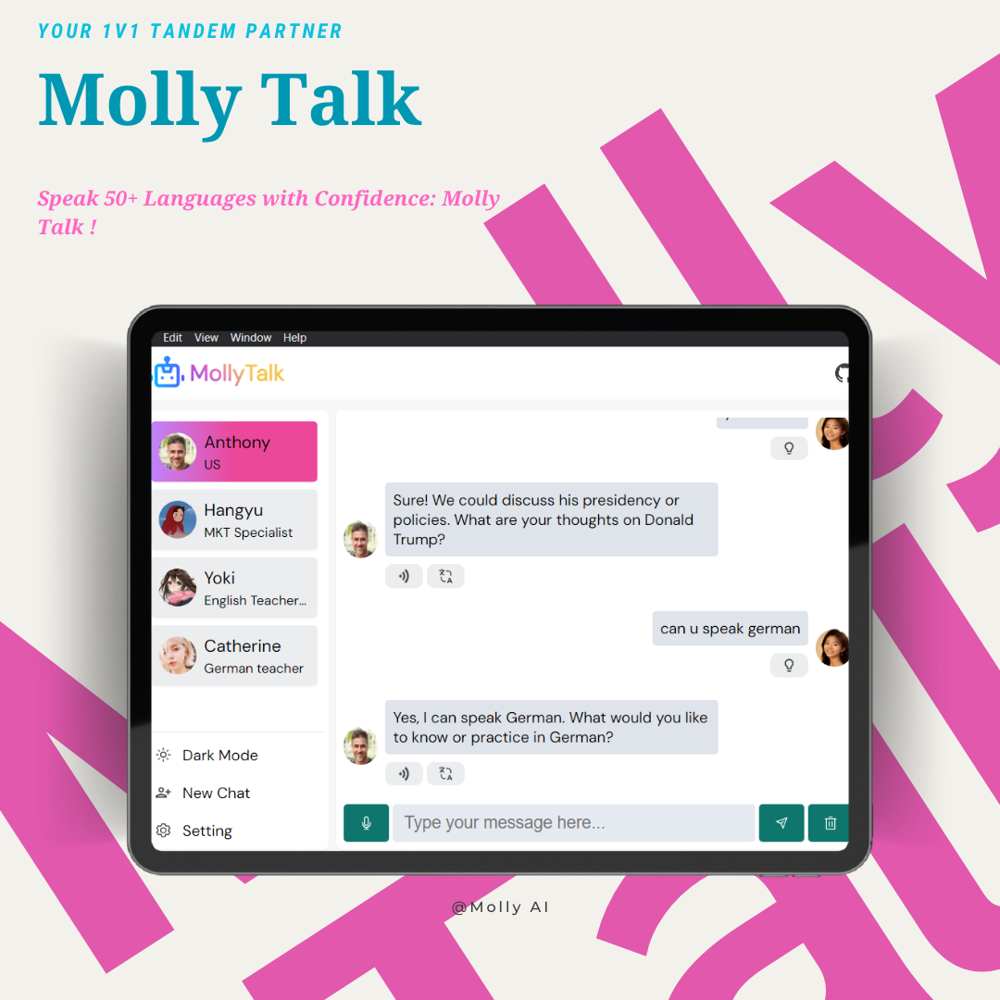
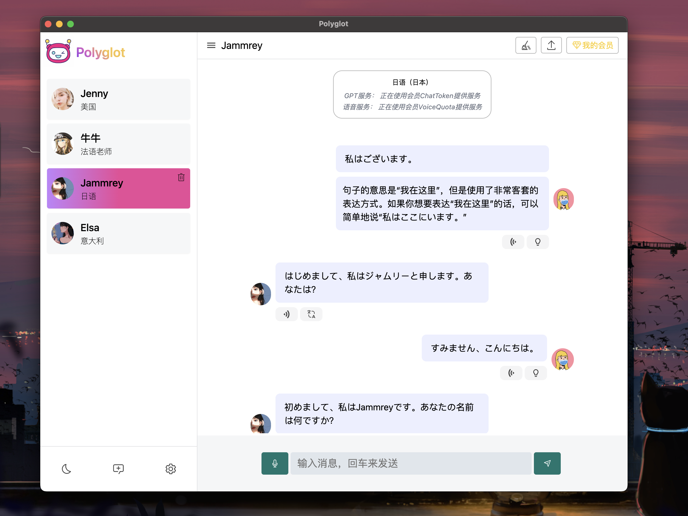

#  Molly Talk

> Eine plattformübergreifende KI-Sprachübungs-App

<p align="left">
<a href="https://github.com/vivianehuang2022/MollyTalk/releases" target="_blank">

</a>
<a href="https://github.com/vivianehuang2022/MollyTalk/releases" target="_blank">

</a>
<a href="https://github.com/vivianehuang2022/Molly Talk/releases" target="_blank">

</a>
<a href="https://github.com/vivianehuang2022/Molly Talk/releases" target="_blank">

</a>
</p>

<p align="left">
<a href="./README-EN.md">
English
</a>
/

<a href="./README.md">
简体中文
</a>
</p>

<a href="./README-DE.md">
Deutsch
</a>
</p>

Molly Talk ist eine plattformübergreifende Desktop-Anwendung (derzeit unterstützt sie die [Webversion]()). Sie basiert auf den ChatGPT- und Azure Artificial Intelligence-Sprachmodellen als zugrunde liegende Dienste und zielt darauf ab, eine benutzerfreundliche Sprachübungsplattform für bequeme multilinguale mündliche Übungen bereitzustellen. ([📺 Videolink](/))

<p align="center">
  
</p>

## Download

- **Webversion**： [Online-Link]()

Besuchen Sie die **[GitHub-Veröffentlichungen](https://github.com/vivianehuang2022/MollyTalk/releases)**, um die neueste Version oder eine frühere Version herunterzuladen.

## Software-Screenshots

<details>
<summary>Erweitern</summary>

<p align="center">
  
</p>

<!-- <p align="center">
  
</p> -->

<p align="center">
  
</p>
<p align="center">
  
</p>
<p align="center">
  
</p>

</details>

## Eigenschaften

- [x] Mehrsprachiges mündliches Üben (~~Derzeit eingebaute KI-Charaktere aus vier verschiedenen Ländern, nämlich den Vereinigten Staaten, Japan, Südkorea und Frankreich. In Zukunft können weitere Sprachen hinzugefügt werden~~) (Eingebautes Englisch, andere Sprachen unterstützen jetzt die Anpassung)
- [x] Intelligente Sprachsynthese (derzeit basierend auf dem Azure TTS-Dienst, Überlegungen zur Integration lokal bereitstellbarer Sprachmodelle in der Zukunft)
- [x] Intelligente Konversationsfunktion (basierend auf dem ChatGPT-Dienst)
- [x] Dunkelmodus-Unterstützung
- [x] Integration der Textübersetzungsfunktion
- [x] Unterstützung benutzerdefinierter Sprachen und KI-Charaktere
- [x] Benutzerdefinierbare Azure-Schlüsselkonfiguration
- [x] Benutzerdefinierbare Avatare
- [x] Spracherkennung mit Tastenkombinationen (Drücken und Halten der Leertaste, um die Spracherkennung zu starten, Loslassen der Leertaste, um die Spracherkennung zu beenden)

- [x] Unterstützung benutzerkonfigurierbarer benutzerdefinierter Konversationsszenarien
- [x] Unterstützung der Selbststimmenwiedergabe
- [ ] Unterstützung von Azure OpenAI-API, Claude-API-Diensten (Azure OpenAI-API wird bereits unterstützt)
- [x] [Webversion](https://polyglotai1.xyz) (Derzeit nicht hochkompatibel mit mobilen Geräten!)
- [x] Unterstützung für KI-Antwortinhaltsverschleierung
- [x] Hervorheben entsprechender Wörter basierend auf dem Wiedergabefortschritt während der Sprachwiedergabe
- [x] KI bietet Antwortvorschläge

## Verwendung

- Richten Sie [OpenAI Key](https://platform.openai.com/account/api-keys) ein
- Richten Sie einen Proxy ein (optional)
- Richten Sie [Azure Key](https://portal.azure.com/) ein
- Erstellen Sie einen neuen KI-Charakter für die Unterhaltung
- Üben Sie das Sprechen mit KI-Charakteren.

## Entwicklung

```bash
# 1. Klonen Sie dieses Repository;
git clone https://github.com/vivianehuang2022/MollyTalk.git

# 2. Abhängigkeiten installieren;
cd MollyTalk
pnpm install
# Wenn die Installation von Electron fehlschlägt, versuchen Sie es mit Taobao-Spiegelquelleninstallation👇:
# export ELECTRON_MIRROR=http://npm.taobao.org/mirrors/electron/ && pnpm i

# 3. Konfigurieren Sie relevante Umgebungsvariablen gemäß den Kommentaren
mv .env.example .env

# 4. Starten Sie den Dienst
pnpm dev
```
