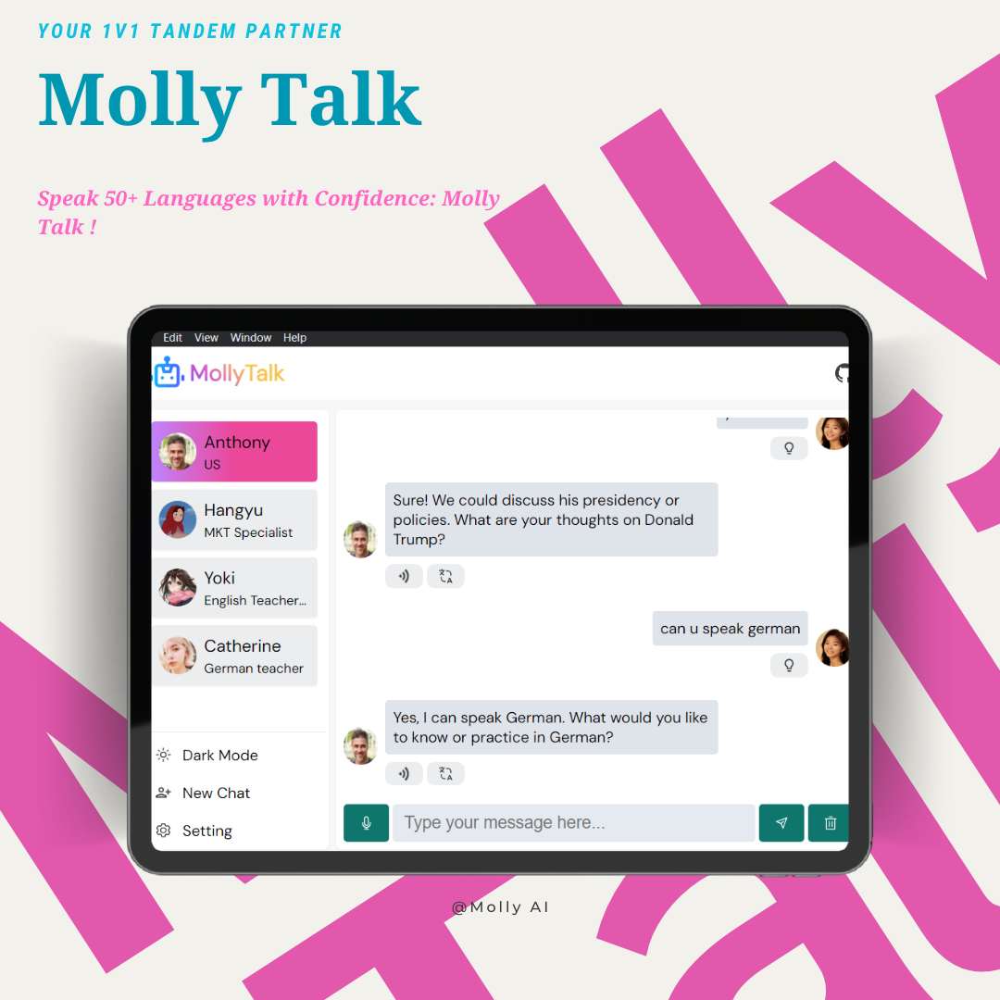
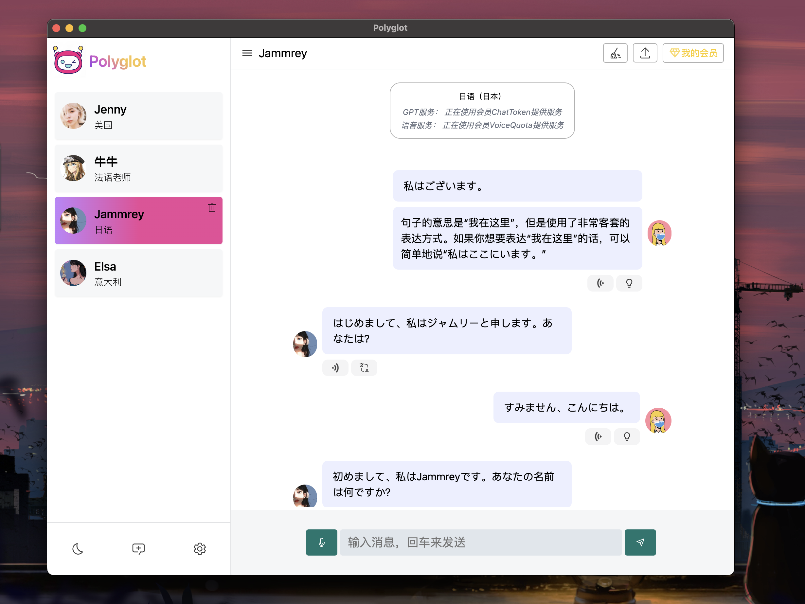

#  Molly Talk

> Cross-platform AI language practice app

<p align="left">
<a href="https://github.com/vivianehuang2022/Molly Talk/releases" target="_blank">

</a>
<a href="https://github.com/vivianehuang2022/Molly Talk/releases" target="_blank">

</a>
<a href="https://github.com/vivianehuang2022/Molly Talk/releases" target="_blank">

</a>
<a href="https://github.com/vivianehuang2022/Molly Talk/releases" target="_blank">

</a>
</p>

<p align="left">
<a href="./README-EN.md">
English
</a>
/

<a href="./README.md">
简体中文
</a>
</p>

<a href="./README-DE.md">
Deutsch
</a>
</p>

Molly Talk is a cross-platform desktop application (currently supporting the [web version]). It is based on ChatGPT and Azure Artificial Intelligence language models as underlying services, aiming to provide an easy-to-use language practice platform for convenient multilingual oral exercises. ( [📺 video link]() )

<p align="center">
  
</p>

## Download

- **Web Version**： [Online Link]()

Visit the **[GitHub Releases](https://github.com/vivianehuang2022/Molly Talk/releases)** to download the latest version or any previous release.

## Software Screenshots

<details>
<summary>Expand</summary>

<p align="center">
  
</p>

<!-- <p align="center">
  
</p> -->

<p align="center">
  
</p>
<p align="center">
  
</p>
<p align="center">
  
</p>

</details>

## Features

- [x] Multilingual oral practice （~~Currently built-in AI characters from four different countries, namely the United States, Japan, South Korea, and France. More languages may be added in the future~~）(Built-in English, other languages now support customization)
- [x] Smart voice synthesis (currently based on Azure TTS service, considering integrating locally deployable voice models in the future)
- [x] Smart conversation feature (based on chatGPT service)
- [x] Dark mode support
- [x] Integration of text translation feature
- [x] Support user-customized languages and AI characters
- [x] User-customizable Azure key configuration
- [x] Custom avatars
- [x] Voice recognition with keyboard shortcuts (press and hold the space bar to start voice recognition, release the space bar to end voice recognition)

- [x] Support user-configurable custom conversation scenarios
- [x] Self-voice playback support
- [ ] Support Azure openai API, claude API services (Azure openai API is already supported)
- [x] [Web Version](https://polyglotai1.xyz) (Currently not highly compatible with mobile devices!)
- [x] Support for AI reply content fuzzing
- [x] Highlight corresponding words based on playback progress during voice playback
- [x] AI provides reply suggestions

## Usage

- Set up[OpenAI Key](https://platform.openai.com/account/api-keys)
- Set up a proxy (optional)
- Set up [azure key](https://portal.azure.com/)
- Create a new AI character for conversation
- Practice speaking with AI characters.

## Development

```bash
# 1. Clone this repository;
git clone https://github.com/vivianehuang2022/Molly Talk.git

# 2. Install dependencies;
cd Molly Talk
pnpm install
# If the installation of electron fails, try installing with Taobao mirror source👇:
# export ELECTRON_MIRROR=http://npm.taobao.org/mirrors/electron/ && pnpm i

# 3. Configure relevant environment variables according to the comments
mv .env.example .env

# 4. Start the service
pnpm dev
```

## License

[GNU General Public License v3.0](./LICENSE)

# Contributors

<div>
  <a href="https://github.com/vivianehuang2022/Molly Talk/graphs/contributors">
    
  </a>
</div>

## Frequently Questions

<details>
<summary>1. macOS prompts "Molly Talk" cannot be opened because Apple cannot check it for malicious software.</summary>

This error is due to the Gatekeeper security feature in the macOS operating system preventing the application from running.
To resolve this issue, follow these steps:

Open "System Preferences" and click on "Security & Privacy."
In the "General" tab, you will see a message: "Molly Talk" was blocked. Click on "Open Anyway."
Alternatively, you can click "Open Anyways" to open your application.
(Admin permissions may be required to open the application.)

If you don't want to perform these steps every time you open the application, you can add the application to the whitelist to run without being blocked. To add your application to the whitelist, do the following:

Open Terminal and enter the following command:

```sh
xattr -rd com.apple.quarantine /path/to/Molly Talk.app
```

Here, /path/to/Molly Talk.app is the full path to your application.

After running the command, the application will be added to the whitelist, and Gatekeeper will no longer block its execution.

</details>
<details>
<summary>2. How to apply for Azure Speech Service?</summary>

To apply for an API key for Azure Speech Service, you can follow these steps:

- Log in to the Azure portal （https://portal.azure.com/）
- Go to the "Azure Speech Service" page and click the "Add" button.
- In the "Create Azure Speech Service" window, choose your subscription, resource group, region, and specify a name for the new service.
- Select the "F0" pricing tier and click "Create."
- Once created, go to the "Overview" page of the new service to view the key and endpoint.

</details>

## Donations

<table>
  <tr>
    <!-- <th>爱发电</th> -->
    <th></th>
    <th></th>
  </tr>
  <tr>
   <!-- <td><a target="_blank" href="https://afdian.net/a/vivianehuang2022">爱发电</a</td> -->
    <td></td>
    <td></td>
  </tr>
</table>
